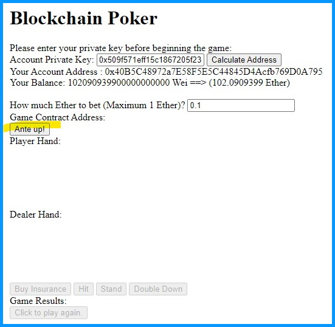
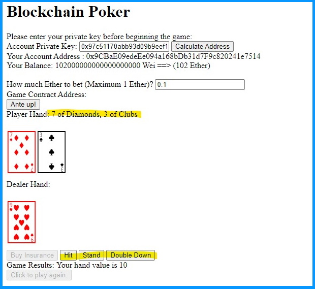
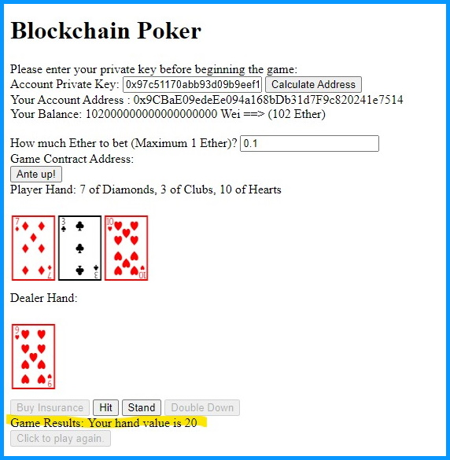
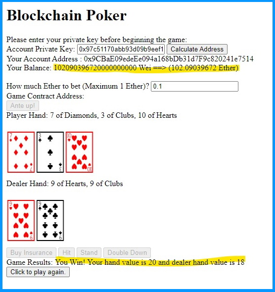

# bChainLotto
## Capstone project for FinTech Bootcamp  
#### by Quang Le, Jordan Hickerson, Ankur Goel

# Introduction and Purpose
When playing games online, it's hard to know if your opponent is cheating. During a game of chess, you opponent may be using chess software to plan his moves. In a game of online poker, your opponent may be collaborating with the website owner to know your cards in advance, or to be dealt favorable cards. It is simply too easy to be scammed online without sufficient safeguards.  

Blockchain technology could be a way of solving many of these issues. Blockchains that are (1) Open, (2) Public, and (3) Neutral will offer verifiable and transparent receipts of each transaction because both the code and records can be made examined in real-time.  

This project will examine 2 different "Games of Chance" to see how we can implement smart contracts on the Ethereum network, and show how to provide open and public gambling games.

Group responsibilities were as follows:  
* Setting up a public Ganache Testnet - Ankur  
    * [bip39_addresses.csv](ankur/bip39_addresses.csv) is a csv of 2000 HD-Wallet addresses and keys
    * [init_bchain.py](ankur/init_bchain.py) is a python script to seed 2000 addresses
* Implementing and Testing a Lotto Smart Contract in Remix - Jordan and Ankur  
    * [BlockLottoGame.sol](jordan/BlockLottoGame.sol) is a Solidity Contract implementing a Lottery
* Implementing both Deployer and Player Lotto UI in Python - Jordan  
    * [cli_creator.py](jordan/cli_creator.py) is a python script to create lottery games, list tickets, finish games and generate winning numbers
    * [cli_player.py](jordan/cli_player.py) is a python script to buy lottery tickets from a pre-exiting lottery
* Analyzing Lotto Numbers - Quang  
    * [winningNumbers.ipynb](quang/winningNumbers.ipynb) is a notebook for analyzing the winning numbers of a 1000 lottery trials
* Implementing BlackJack Smart Contract in Remix - Ankur  
    * [blackjack_1player.sol](ankur/blackjack_1player.sol) is a Solidity Contract implementing a single player BlackJack game against a dealer
* Implement Web UI for BlackJack - Ankur  
    * [index.html](ankur/jstest/index.html) and [main.js](ankur/jstest/main.js) are a web UI using local, unlocked Ganache accounts
    * [index.html](ankur/js_signed_web3/index.html) and [main.js](ankur/js_signed_web3/main.js) are a web UI using either a local Ganache or a public testnet's accounts that are locked, to test web3js's ability to sign transactions  
    * [index.html](ankur/js_metamask/index.html) and [main.js](ankur/js_metamask/main.js) are a web UI using the public testnet's locked accounts via MetaMask, the test web3js and MetaMask integration 

# Play the Games!

## Play Lotto

Our first game is a lottery, and we would like everyone to buy some tickets.  Please clone our player repository as:  

> git clone https://github.com/BaldHeads/play_bChain_lotto

and read the instructions in the how_to_play.md file.   You will need to paste in the contract address of the current lotto game when instructed as the following:  

> 0x7c37ff45f8Df929bc6619324EF4077CDFC0a7368

Please buy some tickets and we will find out if there are any winners during class on Thursday

## Play Blackjack

You can play live blackjack using the following link. You have to paste in your private key in order to play.  Once a hand is complete, you need to refresh the page, or click on the reload button at the bottom of the game to play again.  You will have to paste in the private key every time you play.

http://hardymachine.com.nightshade.arvixe.com/

You can use one of the following private keys  
> 0xb00c8b09d6ffb158a9adcb882e64fc128b74a662f895cc98a9331d24bbf06165
> 0x509f571eff15c1867205f23e980f6febc1c6e85f7dfaffddb24da269c4cc9281
> 0xb55cc89c487411d2636bd81db2a619f07e5d1e61b7091ca2593337ca75799be2
> 0x847b1a78fdbe3c0f9f6bd24ae516a3106002fcca596220a44b6b07d02f3af6c3

# Setting Up a Public Ganache Testnet

Ultimately, we want the entire class to be able to buy tickets in the same lottery. Therefore, we cannot be limited to a local Ganache testnet on our individual developer machines. So we need to setup a public server that we all can get access to.

Linode offers bare-bones Linux servers for $5 per month, offering a basic CPU with 1 Gb of RAM, 25 Gb of storage, and of 1 Tb of monthly bandwidth. Our linode is setup with the base Ubuntu package, along with a single non-root user.  Linode provides a public IPv4 address, and in this case, that is 45.33.17.146 

Linode instances are headless servers, so they can only be directly accessed via an SSH terminal. This means we cannot run a Ganache desktop client directly. Instead, the Truffle suite offers a terminal version of Ganache called `ganache-cli`. 

`ganache-cli` is a terminal version of Ganache that takes the same options and can run test ethereum blockchain for development purposes. 

Once a Linode instance is setup, we can install ganache-cli as:  
> npm install -g ganache-cli  

Using the [BIP39 tool](https://github.com/iancoleman/bip39/releases/tag/0.5.3), we got the randomly generated mnemonic `panther travel sketch action ill portion gallery welcome crumble butter route renew horn shine oak` with ETH coin. This provides the following address at m/44'/60'/0'/0/0:

* address: 0x7E86cfAc3C3bCd76C4a3F6a578acaAb34b9c481a
* public key : 0x0376025d39ec6cc2e42f45bddbfee2607648c907c41e9dfd7954cfb41d2c78aaa4
* private key : 0x8c5784cca8b5444cb8ed7f06297b29a88ffaa31236c872793918c45a1c376710

We use the same mnemonic to derive a total of 2000 addresses and store them in a CSV file located at [bip39_addresses.csv](ankur/bip39_addresses.csv).

Finally, we can instantiate the chain with a single address with a large amount of ether (priced in wei).  This command is 32 zeros, so 10^14 ether:

> ganache-cli --chainId 5337 --db ./gandb -v -h 45.33.17.146  --account="0x8c5784cca8b5444cb8ed7f06297b29a88ffaa31236c872793918c45a1c376710,100000000000000000000000000000000" 

This produces a directory called `gandb` that holds the data on the blockchain. Should our SSH terminal ever quit, we can re-run the same command and `ganache-cli` will simply use the pre-existing `gandb` blockchain and maintain historical transactions without starting from scratch.  

However, should we ever need to re-start our chain from scratch, we simply delete `gandb` and re-run the `ganache-cli` command again.

> rm -rf gandb

For testing purposes for ourselves and our classmates, we need accounts with several Ether pre-loaded. [init_bchain.py](ankur/init_bchain.py) is a Python script that uses Web3py to load in the 2000 accounts in the CSV file and transfer them 100 ETH each.

These private keys were provided to our classmates and instructors for use.

# Lotto Smart Contract

[BlockLottoGame.sol](jordan/BlockLottoGame.sol) is the solidity contract that represents a single lottery. The contract must be re-deployed each time a new lottery is played.

Since this lottery has a charity component, a payable `beneficiary` is important in the definition variables and within the constructor function for reuse. Other base components include the contract `starter` and the `maxBallNum`. `isOpen` is the assertion that the lottery is currently in play and is default set to true upon initiating a contract. `openStatus` and `requireStarter` modifiers are added for functions to eliminate rewriting the respective require statements. This will help developers modify the existing contract to incorporate additional features if desired. 

### Main Functions 

* `buyTicket` allows players to buy a ticket with 6 chosen numbers from 1 - `maxBallNum` for 1 ETH
* `generateWinningNumbers` generates 6 random unique numbers as the winning ticket
*  `finalize` closes the lottery, calls `generateWinningNumbers`, and uses the winning numbers to encode a `winningTicket`. We added a `fakeFinalize` function for testing the actual payout in the case of winning tickets.

### View Functions

* `isOpen` default to true, representing the lotto status as playable when true, and finished/closed when false
* `lottoPot` shows the current value of the lotto pot, this should be 0 when the lotto is closed.

### Storing Lottery Tickets

In order to find winning tickets and pay out the winners, we need to create a mapping between tickets and buyer addresses. The initial idea was to create a `mapping(address payable => uint[6])` ; however, that created a real problem because we have to loop through the entire mapping and match each ticket against the winning numbers, which could easily exceed gas limits if we sell millions of tickets in the lottery.  Instead, we created a mapping of ticket => buyer, so that the winning ticket is the key to the map.  Unfortunately, Solidity does not allow an array or a struct to be a mapping key, so we had to encode the winning ticket into a uint64.  This allows for a `mapping(uint64 => address payable)` and returns all addresses that purchased tickets that match the winning numbers. The function `encodeTicket` will accept 6 uint8's as the input and return a `uint64` where each number is byte shifted to allow it to be packed into the `uint64`, which is then used as a key to the mapping.

### Sorting Numbers

In order to compare the combination of 6 numbers on the winning ticket to any other ticket, the numbers must be sorted. The contract will sort the winning numbers using a bubble sort.  Even though bubble sort has algorithmic runtime of 0(n²), the mere fact that we are only sorting 6 numbers means the overall cost is much lower than more complicated sorts such as quicksort.

Note - it is the client's responsibility (either the client UI or the ticket buyer directly) to call buyTickets with pre-sorted numbers in order to save on gas fees.

# Lotto Python User Interface

[Creator Interface](jordan/cli_creator.py) 

[Player Interface](jordan/cli_player.py)

Two UI's: one for contract creator and one for lotto players

 
Creator file uses abi.json and bytecode.json

Player file only uses abi.json

The creator can start a contract with a private key for each the starter and the beneficiary. They will then receive a contract address to share with players. They can finalize, show the lotto pot, and get a list of existing tickets. 

The player will need to put in their private key and the contract address to interact. They will then have the ability to buy tickets picking their own numbers or having them randomly chosen. These numbers are picked using python's random library and both picked and random tickets are sorted within the buy function of the interface. 

 

Explanations on how to play can be found [here](jordan/how_to_play.md)
 

# Lotto Number Analysis

A count function will be ran on 1000 samples and the first 6 and last 6 numbers will be used.

* 6 most frequent numbers : [10, 18, 21, 22, 24, 39]
* 6 least frequent numbers : [7, 12, 19, 30, 41, 59]
* prediction1 = [7,11,21,35,42,60]
* prediction2 = [10,19,21,28,43,56]
* prediction3 = [2,9,20,34,41,44]
* prediction4 = [1,17,33,35,46,52]

# BlackJack Smart Contract

[blackjack_1player.sol](ankur/blackjack_1player.sol) is the solidity contract that represents a single BlackJack game. The contract must be re-deployed each time a new game is played.

Each card is represented by an integer from 0-51:
    * 0-12 is Ace to King of Spades
    * 13-25 is Ace to King of Hearts
    * 26-38 is Ace to King of Diamonds
    * 39 to 51 is Ace to King of Clubs

The dealer will hit on any hand of 16 or below, and stand on 17 or above, regardless of how many aces it has.

The contract stores both the player hand and the dealer hand as `uint8[]` arrays.  It also stores the deck as a `uint8[52]`.

The dealer deploys the contract and calls the `constructor` with the player's address and the amount of the bet.  The `constructor` is a payable function, and the dealer must provide at least 2.5X the bet amount as a staking pot.

The player will then need to call `ante`.  The `ante` function will deal out 2 cards each to the player and the dealer.  If the player has BlackJack, but the dealer does not, the player gets paid out 2.5X his bet.  If both player and dealer have BlackJack, the player gets his bet back as a push.

After `ante`, the player has the option to call `doubleDown`. This is only allowed immediately after `ante`.  A single card will be dealt to the player, and then the dealer will play out until a winner is declared.

The player will then need to call `hit` as many times as they need to. If the player ever busts over 21, the game will immediately end.

If a player is at 21 or below, he can call `stand`. This will cause the dealer to play its hand out. If the player beats the dealer, he gets 2X his original bet.  Any money remaining in the pot is paid back to the dealer.

At any time, the dealer can call `endGame` if the player is unresponsive. This will return the bet amount to the player and the staking amount to the dealer and then finish the game.

The following view functions are available as well:

* `getPlayerHand` will return an array of the player's cards
* `getDealerhand` will return the dealer's face-up card during the game, and the entire dealer's hand once the game is finished
* `getPlayerHandValue` will return the numerical value of the player's cards
* `isFinished` - true if game is finished, false otherwise
* `isStarted` - true if player has ante'd up, false otherwise

# BlackJack Web User Interface

There are 3 implementations of the web user interface in order to progressively learn more about web3js.  

1. In the `ankur/testjs` folder, this version only works with a local ganache testnet on http://127.0.0.1:8545 and only works with unlocked accounts, i.e. there are no private keys involved to sign transactions. This means we can directly `deploy` contracts, and either `call` or `send` contract methods.
2. In the `ankur/js_signed_web3` folder,  all transactions must be signed with a private key. This means a transaction object must be prepared for non-view contract actions, then signed, and then sent via `sendSignedTransaction`. This seems like the process you would use if you are writing scripts in node.js.
3. Finally, in the ankur/js_metamask folder, the player contract functions can either `call` or `send` contract methods again, and MetaMask will handle signing and forwarding the calls to the contract.  Web3js seems to be easiest to use when using MetaMask, and this would be the process you would use when writing web content.  Quick Note - since MetaMask injects it's own Web3 instance, we have to use a separate web3 object for the dealer's contract calls so they don't go through MetaMask.

Each implementation has 4 files:  

1. index.html - the HTML file that defines the UI
2. main.js - the file that holds all the scripting
3. blackjack_abi.js - the contract JSON abi provided by remix
4. blackjack_bytecode.js - the bytecode JSON object provided by remix

## Basic Walkthrough

When you first load http://hardymachine.com.nightshade.arvixe.com/ , you'll need to paste in a private key and press the `Calculate Address` button

You will then need to enter a bet amount and click `Ante nUp`

After the ante, you can see the cards are dealt, the hand is described, and the `hit`, `stand`, and `double` buttons are now available.

We are now showing a 10, so we might as well hit:

We were dealt a 10 of Hearts. With a total of 20, we can stand and end the game.  The dealer has automatically dealt out his cards and is showing 18, so we win!. Note that our balance has change with a 0.1 ETH win minus some gas fees.

